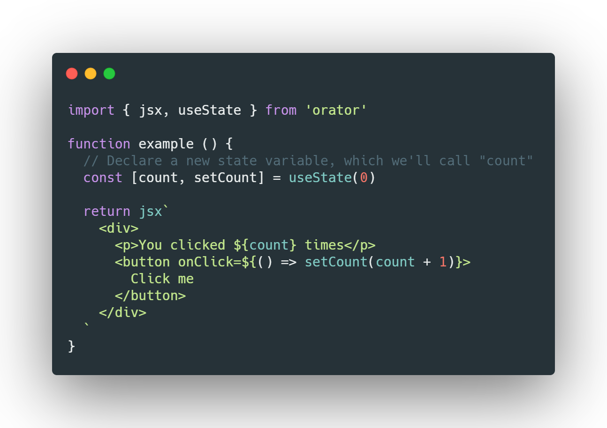

<h1 align="center">
  oops(hooks library)
</h1>

**oops** has built-in jsx parsing function, but you can also compile jsx with babel.

  

## Hooks
The `observedBits` function of `context` is not implemented yet.

### Basic Hooks
+ [x] `useState`
+ [x] `useEffect`
+ [x] `useContext`

### Additional Hooks
+ [x] `useReducer`
+ [x] `useCallback`
+ [x] `useMemo`
+ [x] `useRef`
+ [x] `useLayoutEffect`
+ [x] `useImperativeHandle`
+ [ ] `useTransition`
+ [ ] `useDeferredValue`

## API
+ [x] `h`
+ [x] `jsx`
+ [x] `memo`
+ [x] `render`
+ [x] `createContext`
+ [x] `createRef`
+ [x] `forwardRef`
+ [x] `isValidElement`
+ [ ] `lazy`
+ `Children`
  + [x] `map`
  + [x] `forEach`
  + [x] `count`
  + [x] `toArray`
  + [x] `only`

## Built-in components
+ [x] `<Fragment/>`
+ [ ] `<Suspense/>`
+ [x] `<Context.Provider/>`
+ [x] `<Context.Consumer/>`