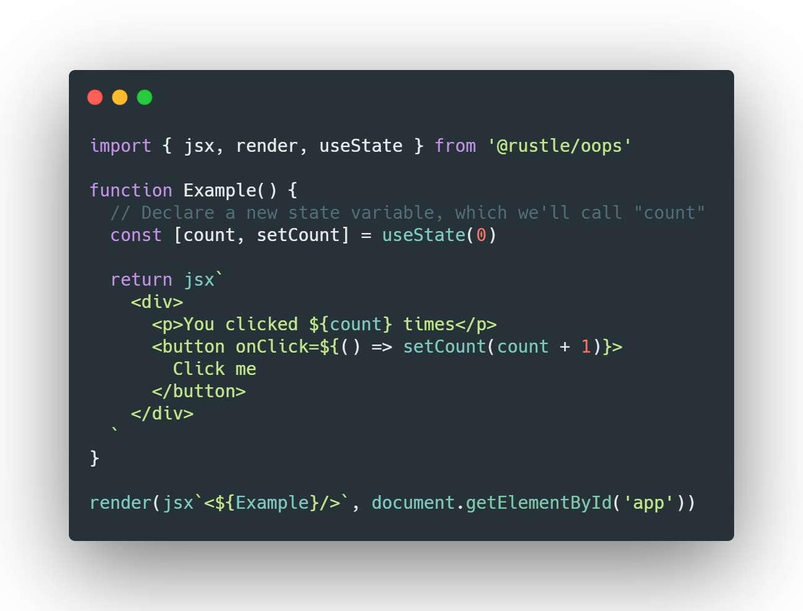

<h1 align="center">
  oops(hooks library)
</h1>

[](https://badge.fury.io/js/%40rustle%2Foops)

**oops** has built-in jsx parsing function, but you can also compile jsx with babel.

<p align="center">
  
</p>

## Hooks
### Basic Hooks
+ [x] `useState`
+ [x] `useEffect`
+ [x] `useContext`

### Additional Hooks
+ [x] `useReducer`
+ [x] `useCallback`
+ [x] `useMemo`
+ [x] `useRef`
+ [x] `useLayoutEffect`
+ [x] `useImperativeHandle`
+ [ ] `useTransition`
+ [ ] `useDeferredValue`

## API
+ [x] `h`
+ [x] `jsx`
+ [x] `memo`
+ [x] `render`
+ [x] `createContext`
+ [x] `createRef`
+ [x] `forwardRef`
+ [x] `isValidElement`
+ [x] `createPortal`
+ [ ] `lazy`
+ `Children`
  + [x] `map`
  + [x] `forEach`
  + [x] `count`
  + [x] `toArray`
  + [x] `only`

## Built-in components
+ [x] `<Fragment/>`
+ [ ] `<Suspense/>`
+ [x] `<Context.Provider/>`
+ [x] `<Context.Consumer/>`

## Caveats
  1. The `observedBits` function of `context` is not implemented yet.

  2. The `functional components` also supports `defaultProps`.
  
  3. Beacase the `React` event system is customized, so, the dom created by the `createPortal` methods allow event bubbling to parent node in `vitualDOM` tree. But `oops` uses native event system. our event bubbling behaviors exist in real dom tree that result we can't achieve the same behavior with the `React`, But our bubbling behavior can still be performed according to the structure of the `vitualDOM` tree.

  [demo](http://jsrun.net/eEfKp)
  ```jsx
    import { render, useState, useEffect, createPortal } from '@rustle/oops'

    const el = document.createElement('div')
    const appRoot = document.getElementById('app-root')
    const modalRoot = document.getElementById('modal-root')

    // Listening to the bubbling behavior of the native event system 
    el.onclick = e => {
      console.log(e.target)
    }

    function Modal(props) {
      useEffect(() => {
        modalRoot.appendChild(el)
        return () => modalRoot.removeChild(el)
      })
      return createPortal(props.children, el)
    }

    const modalStyles = {
        position: 'fixed',
        top: 0,
        left: 0,
        height: '100%',
        width: '100%',
        display: 'flex',
        alignItems: 'center',
        justifyContent: 'center',
        backgroundColor: 'rgba(0,0,0,0.5)',
    }

    function Child() {
      // The click event on this button will bubble up to parent,
      // because there is no 'onClick' attribute defined
      return (
        <div style={ modalStyles }>
          <button>Click</button>
        </div>
      )
    }

    function Parent(props) {
      const [clicks, handleClick] = useState(0)
      return (
        <div onClick={e => {
          console.log(e.target, e.currentTarget, e.nativeEvent)
          handleClick(clicks + 1)
        }}>
          <p>Number of clicks: { clicks }</p>
          <p>
            Open up the browser DevTools
            to observe that the button
            is not a child of the div
            with the onClick handler.
          </p>
          <Modal>
            <Child />
          </Modal>
        </div>
      )
    }

    render(<Parent />, appRoot)
  ```